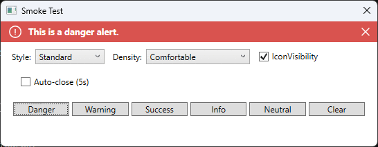

# Alert Bar WPF UserControl

This is a WPF usercontrol for displaying user updates through an alert bar. There are five types of alerts: success, danger, warning, information, or neutral. The color scheme and icons for each are based on the type.



## Dependencies

- WPF Application
- Targets `netcoreapp3.1-windows`, `net6.0-windows`, `net8.0-windows`, and `net10.0-windows` (.NET Framework is no longer supported)

## Usage

Install from [NuGet](https://www.nuget.org/packages/AlertBarWpf/):

```
dotnet add package AlertBarWpf
```

Or reference the source directly with a `<ProjectReference>` to `src/AlertBarWpf.csproj`.

**GUI:**
In the xaml you must reference the namespace to add the usercontrol:

```html
<Window ... xmlns:mbar="clr-namespace:AlertBarWpf;assembly=AlertBarWpf"></Window>
```

Using this reference place the control on the form. I typically position this above any other controls:

```html
<mbar:AlertBarWpf x:Name="msgbar" />
```

An optional `IconVisibility` parameter to remove icons from all alert messages. There is also a `BarStyle` parameter to adjust the look of the bar:

```html
<mbar:AlertBarWpf x:Name="msgbar" IconVisibility="False" BarStyle="Outline" />
```

**Code Behind:**
To make use of the control we trigger it in the xaml.cs. Call the methods like so:

```csharp
msgbar.Clear();
msgbar.SetDangerAlert("Select an Item.");
```

## Features

- Multiple styles (`Standard` filled and `Outline` outlined-only variants, via the `BarStyle` property)
- Recognizable color scheme/icons for danger, success, warning, information, or neutral
- Does not occupy space when not in use
- Auto-closes (if desired)

## API

**Methods:**

- `Clear()`
- `SetAlert(AlertType alertType, string message, int timeoutInSeconds = 0)` — use when the alert type is only known at runtime
- `SetDangerAlert(string message, int timeoutInSeconds = 0)`
- `SetSuccessAlert(string message, int timeoutInSeconds = 0)`
- `SetWarningAlert(string message, int timeoutInSeconds = 0)`
- `SetInformationAlert(string message, int timeoutInSeconds = 0)`
- `SetNeutralAlert(string message, int timeoutInSeconds = 0)`

Each of the creation methods above takes a message parameter and an optional timeout parameter (based on seconds); a timeout of `0` means the alert stays visible until `Clear()` is called or another `Set*Alert` is triggered.

**XAML Properties:**

- `BarStyle` (`BarStyleType`)
- `Density` (`DensityType`)
- `IconVisibility` (`bool`)
- `CurrentAlertType` (`AlertType`, read-only) — the alert currently displayed by the bar
- `Message` (`string`, read-only) — the text currently displayed by the bar

**Events:**

- `Show` — raised whenever a `Set*Alert` method is called

**`BarStyleType` enum:**

- `Standard`
- `Outline`

**`DensityType` enum:**

- `Comfortable` (default) — larger icon/text/close-glyph sizing
- `Compact` — the original, more tightly-packed sizing

**`AlertType` enum:**

- `None`
- `Danger`
- `Warning`
- `Success`
- `Information`
- `Neutral` — no icon, gray accent; for generic messages with no severity

## Support

Found a bug or have a feature request? [Open an issue](https://github.com/chadkuehn/AlertBarWpf/issues/new).

## Author

**Chad Kuehn**

## Copyright & License

Copyright (c) 2014 Chad Kuehn

AlertBarWpf is available under the MIT license. See the [LICENSE file][7.1]
for more information.

[7.1]: ./LICENSE.txt
